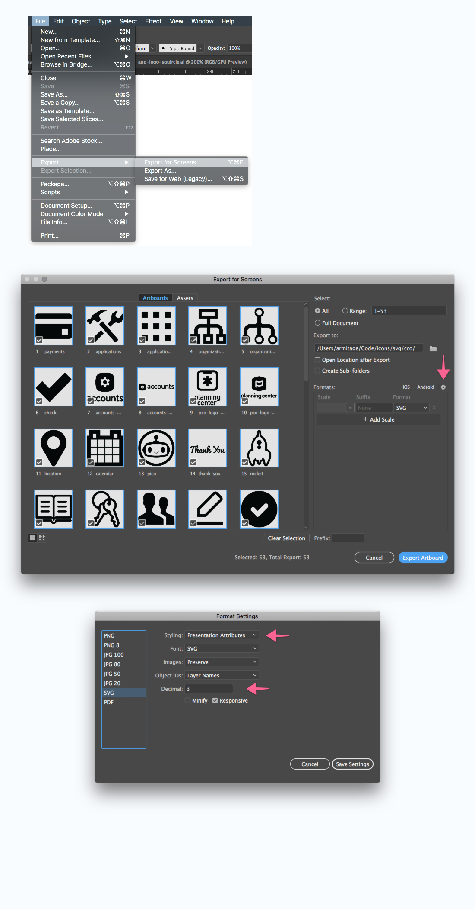

# Contributing

<details>
<summary>Development scripts</summary>

| Command                                | Task                                                 |
| -------------------------------------- | ---------------------------------------------------- |
| `yarn build`                           | build all collections, once                          |
| `yarn build --collection {collection}` | build specified collection, once                     |
| `yarn publish`                         | prompts for new version number, and publishes to npm |

`build` commands will build the SVG sprites **and** rebuild the doc-site.
</details>

<details>
<summary>Add or edit an illustrations</summary>

- locate the source Illustrator file you'd like to update in `src/{collection}.ai`
- make changes and `save`

</details>

<details>
<summary>Export SVGs</summary>

- select `Export for screens`, from the `File` menu
  - export as `SVG`
  - select the corresponding directory (`svg/{collection}/`)
- select these settings
  - `styling` is `Presentation Attributes`
  - `precision` is at least `3`



</details>

<details>
<summary>Build sprites and docs</summary>

- run `yarn build` in the project root.
- watch for errors. the errors should help you.

</details>

<details>
<summary>Publish to NPM</summary>

- run `npm login` (if you haven't)

* run `yarn publish`
  - you'll be prompted for a new version number
  - add version notes to the changelog in [`CHANGELOG.md`](./CHANGELOG.md)

</details>

<details>
<summary>Commit and Push</summary>

- in most cases, just push to `master`
- if you're changing a shared collection, maybe open a PR.

</details>

<details>
<summary>Versioning</summary>

Versions should break down like so

```
v1.0.0
 ^ ^ ^
 │ │ └─ Patch : Documentation and fixes
 │ └─── Minor : Additions
 └───── Major : Deletions and edits
```

When **adding** icons, increment the `Minor` place.

When **editing or removing** icons ("breaking changes"), increment the `Major` place.

When **fixing bugs and updating documentation**, increment the `Patch` place.

**In most cases, you should user the `Minor` place.**

</details>